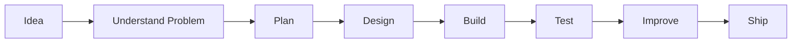

<!-- =========================================================
     HAJEE07 — ADVANCED GITHUB PROFILE README
     Clean • Dark • Animated • Professional
========================================================= -->

<div align="center">

<!-- Animated Header -->


<!-- Typing Animation -->
<a href="https://github.com/Hajee07">
  
</a>

<br/>

<!-- Social / Status Badges -->
<a href="https://github.com/Hajee07">
  
</a>
<a href="https://www.linkedin.com/in/hajee-hajee-6707183b0/">
  
</a>

<br/><br/>


</div>

---

## `> whoami`

```yaml
name: Hajeevan
github: Hajee07

role:
  - Software Engineering Student
  - Aspiring Software Developer

focus:
  - Software Development
  - Web Development
  - Backend Development
  - Databases
  - Practical Problem Solving

mindset:
  - Learn continuously
  - Build consistently
  - Write cleaner code
  - Improve one project at a time

current_goal: "Grow into a strong professional Software Engineer"
```

---

## 👨‍💻 About Me

I enjoy transforming ideas into **practical software solutions** and learning how real applications are designed, developed and improved.

- 🔭 Building practical **software & web applications**
- 🌱 Strengthening **full-stack development**, APIs and database skills
- 🧠 Interested in **clean architecture, backend logic and problem solving**
- 🛠️ Comfortable working with **C#, Python, JavaScript and SQL**
- 🎨 I also use **Figma** for UI planning and prototyping
- 📈 Focused on continuous improvement through real projects
- 🤝 Open to learning, collaboration and developer networking

---

## ⚡ Tech Arsenal

<div align="center">

### Languages


### Frontend


### Backend & Databases


### Tools


</div>

<br/>

<div align="center">


</div>

---

## 🧭 Developer Roadmap

```text
NOW
│
├── Build stronger full-stack projects
├── Improve API & database design
├── Practice clean and maintainable code
├── Improve Git / GitHub workflow
├── Strengthen testing & debugging
│
▼
NEXT
│
├── Advanced backend architecture
├── Authentication & security
├── Deployment & DevOps fundamentals
├── Larger real-world applications
│
▼
GOAL
│
└── Professional Software Engineer 🚀
```

---

## 🔥 What I'm Focused On

<table>
<tr>
<td width="50%">

### 💻 Development

- Full-stack applications
- Backend APIs
- Database-driven systems
- Responsive interfaces
- Authentication workflows
- Clean project structures

</td>
<td width="50%">

### 🧠 Growth

- Problem solving
- Debugging
- Software architecture
- Git best practices
- Code readability
- Continuous learning

</td>
</tr>
</table>

---

## 📊 GitHub Analytics

<div align="center">


</div>

<br/>

<div align="center">


</div>

---

## 🏆 GitHub Trophies

<div align="center">


</div>

---

## 📈 Contribution Activity

<div align="center">


</div>

---

## 🐍 Contribution Snake

<div align="center">

<picture>
  <source media="(prefers-color-scheme: dark)" srcset="https://raw.githubusercontent.com/Hajee07/Hajee07/output/github-contribution-grid-snake-dark.svg">
  <source media="(prefers-color-scheme: light)" srcset="https://raw.githubusercontent.com/Hajee07/Hajee07/output/github-contribution-grid-snake.svg">
  
</picture>

</div>

> The snake appears after the included GitHub Actions workflow runs successfully.

---

## 🧩 My Development Principles

<table>
<tr>
<td align="center" width="25%">

### `01`
**Clean Code**

Readable code is easier to maintain.

</td>
<td align="center" width="25%">

### `02`
**Keep Learning**

Every project should teach something new.

</td>
<td align="center" width="25%">

### `03`
**Build Often**

Skills improve when ideas become real projects.

</td>
<td align="center" width="25%">

### `04`
**Keep Improving**

Better than yesterday is the target.

</td>
</tr>
</table>

---

## 🛠️ How I Approach a Project



---

## 💡 Developer Snapshot

```javascript
const hajeevan = {
  username: "Hajee07",
  role: "Software Engineering Student",

  languages: [
    "C#",
    "Python",
    "JavaScript",
    "SQL"
  ],

  web: [
    "HTML",
    "CSS",
    "React",
    "Flask"
  ],

  databases: [
    "MySQL",
    "PostgreSQL"
  ],

  tools: [
    "Git",
    "GitHub",
    "Visual Studio",
    "VS Code",
    "Figma"
  ],

  status: "Learning. Building. Improving.",
  goal: "Professional Software Engineer"
};
```

---

## 📌 Featured Projects

<div align="center">

### 🚧 More projects are coming soon

As I publish my work, this section will showcase my strongest projects, technologies used and live demos.

<a href="https://github.com/Hajee07?tab=repositories">
  
</a>

</div>

<!--
==========================================================
WHEN YOU HAVE PUBLIC REPOSITORIES, YOU CAN REPLACE THE
SECTION ABOVE WITH CARDS LIKE THESE:

<a href="https://github.com/Hajee07/REPOSITORY-NAME">
  
</a>
==========================================================
-->

---

## 🎯 2026 Development Goals

- [ ] Publish more polished GitHub projects
- [ ] Build strong full-stack applications
- [ ] Improve backend API design
- [ ] Strengthen database design skills
- [ ] Practice testing and debugging
- [ ] Improve documentation quality
- [ ] Contribute consistently on GitHub
- [ ] Build a professional developer portfolio

---

## 🤝 Connect With Me

<div align="center">

### I'm always happy to connect with developers and learn from the community.

<br/>

<a href="https://www.linkedin.com/in/hajee-hajee-6707183b0/">
  
</a>

<a href="https://github.com/Hajee07">
  
</a>

<br/><br/>

### `while(alive) { learn(); build(); improve(); }`

<br/>


</div>
